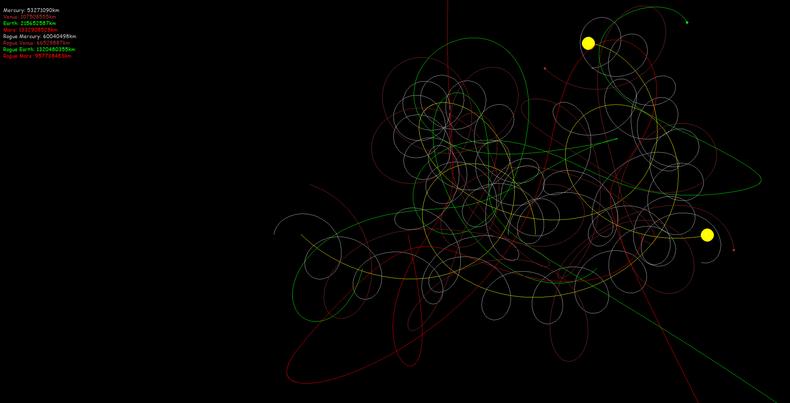
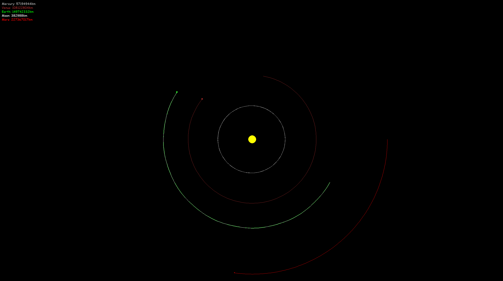

# Celestial Simulator

Basic 2D orbital simulator based on Newtonian physics, written with my daughter as a STEM project.
Launches a window and renders planets moving in orgits.  All controlled by one gravitational constant.
This is a great project to try with kids as you can edit the code and even create your own solar systems.

## Running The Simulation

  - [ ] git clone https://github.com/pkenjora/celestial-simulator
  - [ ] python3 -m pip install -r requirements.txt
  - [ ] python3 simulate.py
    - [ ] python3 simulate.py -load solar
    - [ ] python3 simulate.py -load inner
    - [ ] python3 simulate.py -load collision

## Creating A Simulation

Copy any of the [solar.py](solar.py), [inner.py](inner.py), or [collision.py](collision.py) configurations.
Change the coordinates, distances, and celestial bodies in the simulation, then run using:

- [ ] python3 simulate.py -load [your_new_simulation.py]

## Limitations

This is a quick and simple simulation designed to run on a single CPU for simplicity, it is not fast.
Beyond about 10 celestial bodies the simulation becomes noticably slower.
You can increase the speed by allowing larger time intervals for the force calculation but be careful,
smaller moons and objects need small time intervals to remain tethered to their parents. Setting the
interval too high will send moons and planets shooting off into space.

Celestaial objects are not drawn to scale because at solar system distances the planets would be
single pixels.  The system scales planets proportionally based on specified diameter, as a result
some overlap may occur.

# Fun Things To Do With This Code

Without coding, just create or edit a simulation configuration.

  - [ ] Add a rogue asteroid or comet into the system and see what happens.
  - [ ] Configure a stable binary star system with stable planetary orbits.
  - [ ] Replicate the solar system with all the moons.
  - [ ] Crate a massive black hole in the center of the solar system.

With coding, modify the [simulate.py](simulate.py) file.

  - [ ] Add multi processor support for a faster smoother simulation.
  - [ ] Add ability to zoom in and out.
  - [ ] Add collision detection to objects.
  - [ ] Add 3D support wiht additional axis and perspective.

---
&copy; 2022 Paul Kenjora - Apache License, Version 2.0
